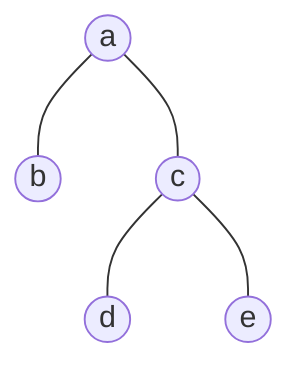

## 题目描述
路径 被定义为一条从树中任意节点出发，沿父节点-子节点连接，达到任意节点的序列。同一个节点在一条路径序列中 至多出现一次 。该路径 至少包含一个 节点，且不一定经过根节点。

路径和 是路径中各节点值的总和。

给你一个二叉树的根节点 root ，返回其 最大路径和 。

## 示例

### 示例输入
> root = [-10,9,20,null,null,15,7]
### 示例输出
> 42
### 示例解释
> 最优路径是 15 -> 20 -> 7 ，路径和为 15 + 20 + 7 = 42

## 示例代码
``` java
/**
 * Definition for a binary tree node.
 * public class TreeNode {
 *     int val;
 *     TreeNode left;
 *     TreeNode right;
 *     TreeNode() {}
 *     TreeNode(int val) { this.val = val; }
 *     TreeNode(int val, TreeNode left, TreeNode right) {
 *         this.val = val;
 *         this.left = left;
 *         this.right = right;
 *     }
 * }
 */
class Solution {
    public int max = -1001;
    public int maxPathSum(TreeNode root) {
        
        int temp = dfs(root);
        return max;
    }

    public int dfs(TreeNode root) {
        if (root == null ){ 
            return 0;
        }
        int leftMax = Math.max(0, dfs(root.left));
        int rightMax = Math.max(0, dfs(root.right));
        int selfMax = leftMax + rightMax + root.val;
        max = Math.max(selfMax, max);
        return Math.max(leftMax,rightMax) + root.val; 
    }
}
```

## 思路
不好想，但二叉树毕竟还是二叉树，想着递归啊，dfs啊，bfs啊总能做出来。
****
画个图就好理解了


以c点为准， 看经过c点的最大路径有3种可能性
1. d --> c --> e
2. d --> c --> a
3. e --> c --> a
   
这三种情况的路径和处理步骤
1. 先撇开c 也就是 root.val 不算
2. 取得最大子节点的情况
3. 用一个值进行存储上述可能性1的值，因为路径是一笔画，一旦是情况1就不可能再继续加了。
   * max_num = max(max , 根节点+左最大+右最大);
   * 存储所有情况1的最大值
4. 问题就到了怎么取得节点最大值（最大贡献）
   * root.val + max(root.left,0) 
   * root.val + max(root.right,0)
5. 为什么最后输出结果不需要返回值和max比较
   由于最后一步的dfs 左右两侧都会取到最大的值，且根节点是没有父节点的，三种情况也就自然变成了，左加根、右加根、左加右加根三种，负数情况会被当做0也就是不计入加法，如果加一起没原来大，那就保留原来的即可。