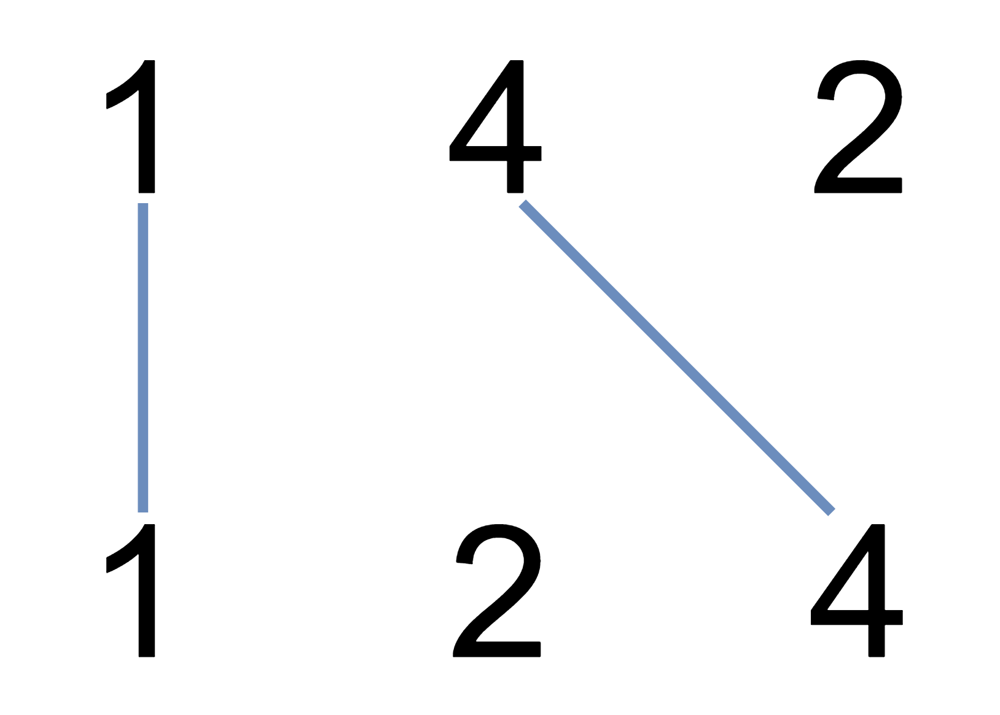

## 题目描述
在两条独立的水平线上按给定的顺序写下 nums1 和 nums2 中的整数。

现在，可以绘制一些连接两个数字 nums1[i] 和 nums2[j] 的直线，这些直线需要同时满足满足：

 nums1[i] == nums2[j]
且绘制的直线不与任何其他连线（非水平线）相交。
请注意，连线即使在端点也不能相交：每个数字只能属于一条连线。

以这种方法绘制线条，并返回可以绘制的最大连线数。

## 示例

``` text
输入：nums1 = [1,4,2], nums2 = [1,2,4]
输出：2
解释：可以画出两条不交叉的线，如上图所示。 
但无法画出第三条不相交的直线，因为从 nums1[1]=4 到 nums2[2]=4 的直线将与从 nums1[2]=2 到 nums2[1]=2 的直线相交。
```

## 示例代码
``` java
class Solution {
    public int maxUncrossedLines(int[] nums1, int[] nums2) {
        int m = nums1.length;
        int n = nums2.length;
        int[][] dp = new int[m+1][n+1]; 
        for(int i = 1; i <= m; i++) {
            int num1 = nums1[i-1];
            for(int j = 1; j <= n; j++) {
                int num2 = nums2[j-1];
                if (num1 == num2) {
                    dp[i][j] = dp[i-1][j-1] + 1;
                } else {
                    dp[i][j] = Math.max(dp[i][j-1],dp[i-1][j]);
                }
            }
        }
        return dp[m][n];
    }
}
```