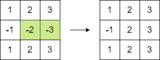

## 题目描述
给你一个 n x n 的整数方阵 matrix 。你可以执行以下操作 任意次 ：

* 选择 matrix 中 相邻 两个元素，并将它们都 乘以 -1 。
* 如果两个元素有公共边 ，那么它们就是相邻的。

你的目的是 最大化 方阵元素的和。请你在执行以上操作之后，返回方阵的最大和。

## 示例

``` text
输入：matrix = [[1,2,3],[-1,-2,-3],[1,2,3]]
输出：16
解释：我们可以执行以下操作使和等于 16 ：
- 将第二行的最后 2 个元素乘以 -1 。
```

## 示例代码
``` java
class Solution {
    public long maxMatrixSum(int[][] matrix) {
        int negativeCount = 0;
        int min = Integer.MAX_VALUE;
        long sum = 0;
        int n = matrix.length;
        for (int i = 0; i < n; i++) {
            for (int j = 0; j < n; j++ ) {
                int cur = matrix[i][j];
                sum += Math.abs(cur);
                if (cur < 0) negativeCount++;
                min = Math.min(min, Math.abs(cur));
            }
        }
        if (negativeCount % 2 == 1) sum -= min * 2L;
        return sum;
    }
}
```